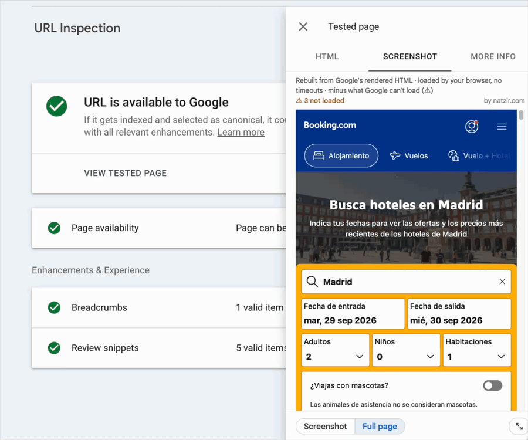
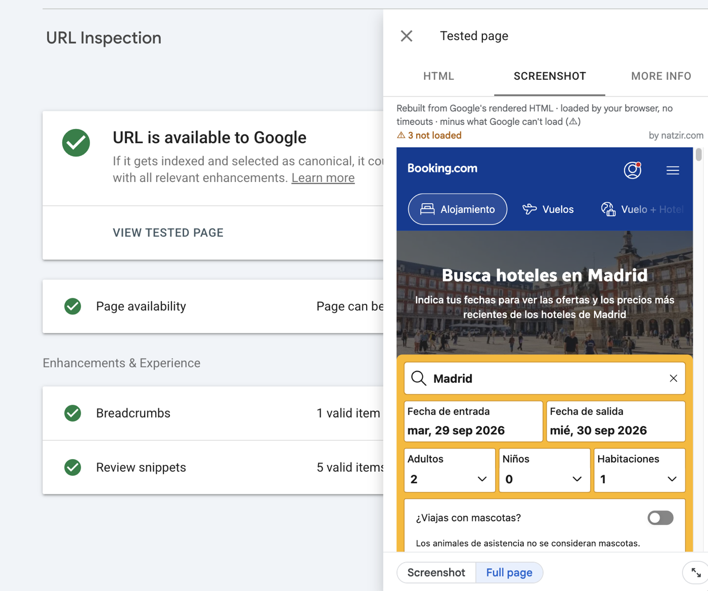
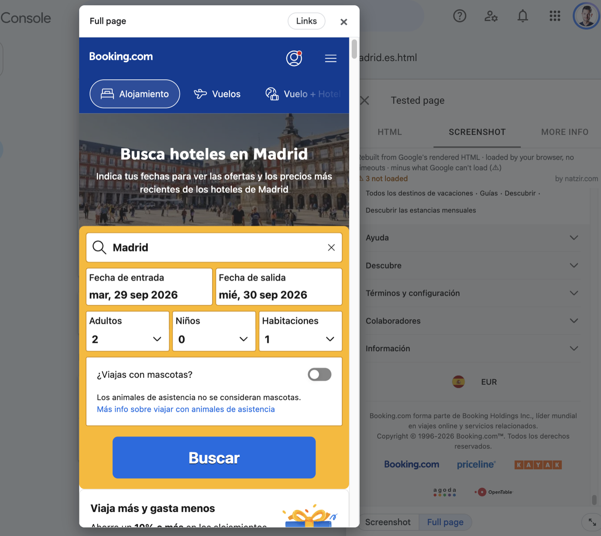
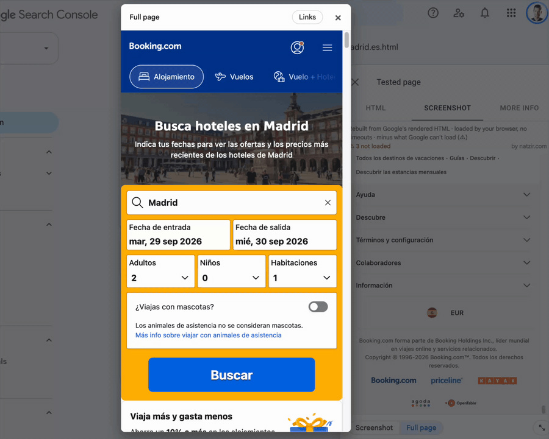
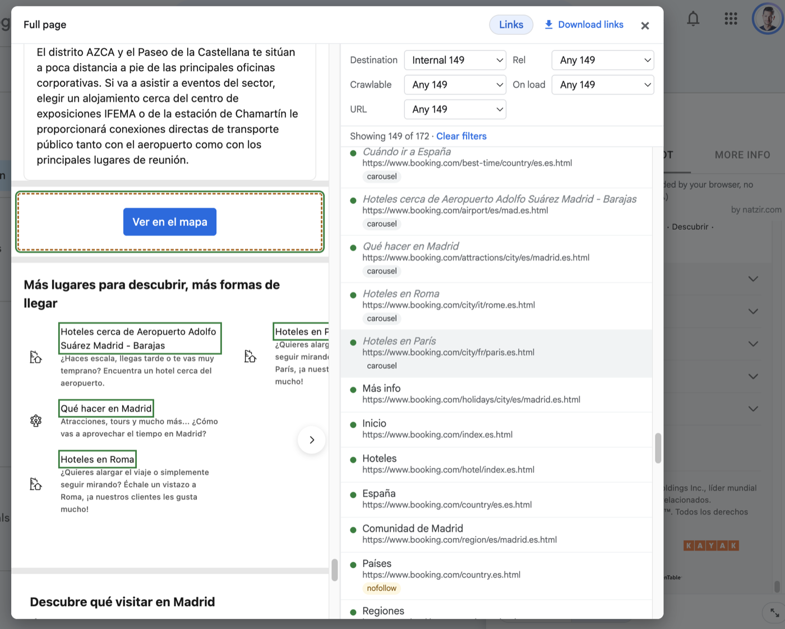

# Google Search Console Full Fetch & Render

GSC Full Render for short. A Chrome extension, and a bookmarklet, for Search Console's URL
Inspection. Search Console only shows a screenshot in the live test, and it stops at about 1,750 px:
the crawled page has none. This rebuilds the whole page from the HTML Google rendered, right in the
*Screenshot* tab, and lists all its links.

**What it is, and what it isn't.** The HTML is Google's: the DOM its renderer built, with the
page's JavaScript already run. The styles, images and fonts are not: your browser loads them now
from the site, not through Google's crawl. So it shows how Google may have laid the page out, not a
capture of what it saw, and it can differ if the site serves Googlebot something else or has
changed since the crawl (a crawled page can be weeks old).

## Why

- It uses the HTML Google rendered for that URL. Headless Chrome tools, and my own
  [Puppeteer Colab (2020)](https://x.com/natzir9/status/1321441105800503296), can only imitate it.
- You find odd URLs in the Pages report: inspect the pages that may link to them and look for the
  link in the list. You'll see where it is on the page and whether users can see it.
- Audits: check that a link is in the rendered HTML, and whether it's nofollow, not crawlable,
  has parameters or is relative without a slash.
- It shows what Search Console couldn't load, and why.

## Install

**Chrome extension:** [GSC Full Fetch & Render as Googlebot by Natzir](https://chromewebstore.google.com/detail/gsc-full-fetch-render-as/ljlijkonoghompcadbfihdjnkbcmbpan) on the Chrome Web Store. It turns on by itself in URL Inspection.

**Bookmarklet**, if you'd rather not install an extension: open
[natzir.github.io/gsc-full-render](https://natzir.github.io/gsc-full-render/) and drag the **GSC Full
Render** button to your bookmarks bar. If you can't see the bar, show it with Ctrl+Shift+B (⌘+Shift+B
on a Mac).

## Use

1. In URL Inspection, open *View tested page* or *View crawled page*.
2. The *Screenshot* tab shows the full page.
   - With the extension it is already there. Its icon turns it off in that tab and on again. To
     turn it on yourself each time, right-click the icon and uncheck *Turn on automatically in
     URL Inspection*.
   - With the bookmarklet, click the bookmark, and click it again to turn it off.

   

3. `⤢` opens the page larger. **Links** shows the list with its filters, outlines the links on
   the page and lets you download them as CSV.

   
   
   

## What the full page leaves out

Images, styles and fonts load from your browser, so the test's timeouts don't apply. It only
leaves out what Google certainly can't load, with an amber outline where it was:

- resources blocked by robots.txt
- resources that return an HTTP error (404, 5xx)
- lazy images whose script never ran (the HTML still has the placeholder)

"Other error" is loaded anyway: Search Console doesn't say what happened, and it's often the
test's own time limit. `⚠ N not loaded` lists everything with its reason.

## Link filters and CSV

- **Destination**: internal or external.
- **Rel**: follow, nofollow, ugc, sponsored.
- **Crawlable**, and why not (`javascript:`, empty `href`, `onclick`…).
- **On load**: visible, in a carousel, collapsed (menu, tab, "see more"), invisible (opacity 0,
  hidden until a scroll or a click) or hidden (screen-reader only, or moved off the page).
- **URL**: parameters, fragment, link to the same page, http, uppercase, spaces or non-ASCII,
  over 115 characters, absolute or relative, relative without `/`, `//`, and a domain without
  `https://` (the browser reads `www.site.com/page` as a path).

The CSV has a column for each.

## Limits

- Scripts don't run, so content that only appears when you scroll may stay hidden.
- It can't check status codes or redirects: from Search Console the browser can't read other
  sites' responses.
- Styles, images and fonts are loaded now by your browser, not by Google. If a server serves
  Googlebot something different, or the site has changed since the crawl, the result can differ.

## Disclaimer

Not affiliated with Google. Google and Google Search Console are trademarks of Google LLC.

It doesn't send data anywhere: everything runs in your browser. The only requests are for the
page's own images, styles and fonts, straight to the site and without a referrer.

The extension keeps one setting in your browser, whether it turns on by itself. See
[PRIVACY.md](PRIVACY.md).

## Develop

`npm install`, `npm test`, and `npm run build` to update `dist/`: `install.html` and
`bookmarklet.txt` for the bookmarklet (with a copy of the install page in `docs/index.html`, which
GitHub Pages serves), and `dist/extension/`, which Chrome loads with *Load unpacked*. `npm run pack` zips it for the Chrome Web Store, and `npm run icons` redraws its icons.

## License

MIT, see [LICENSE](LICENSE).
